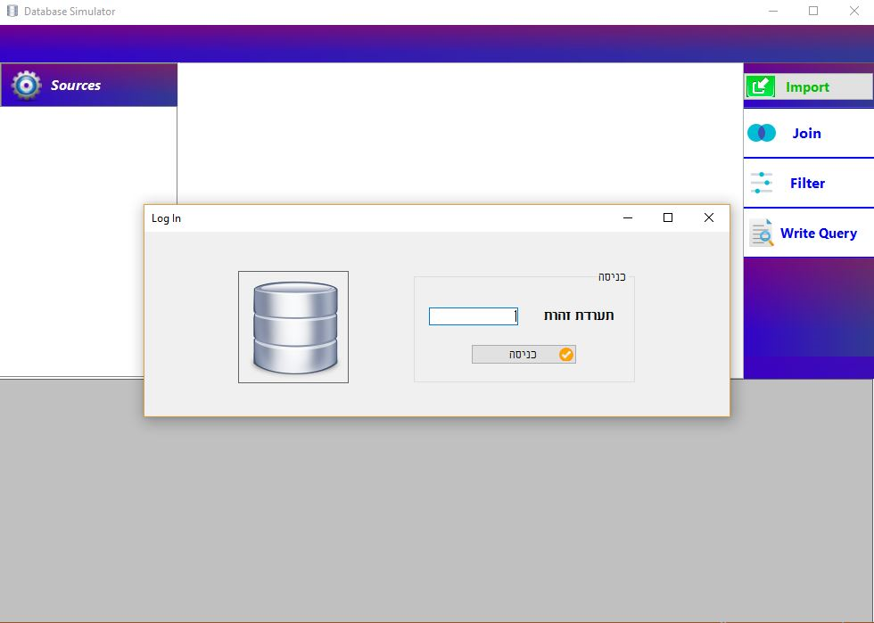
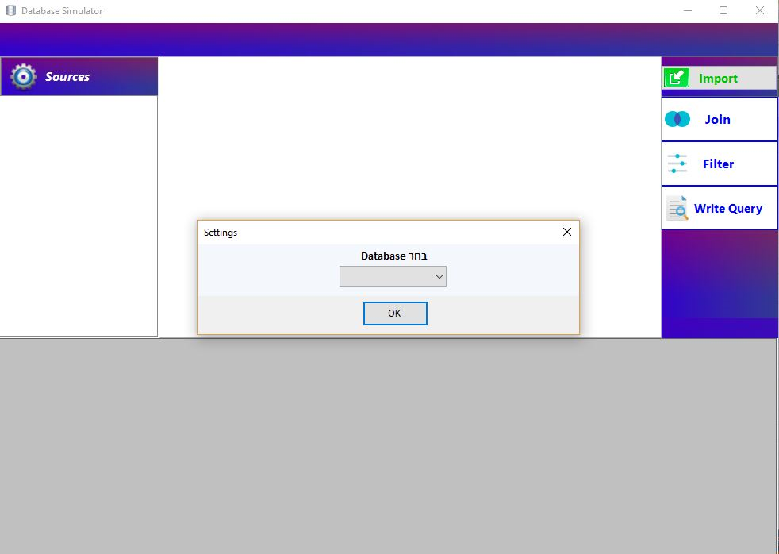
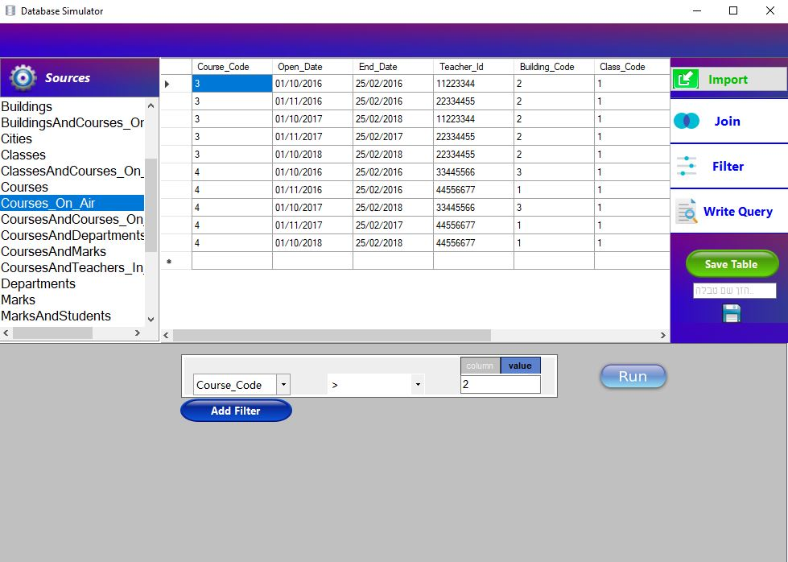
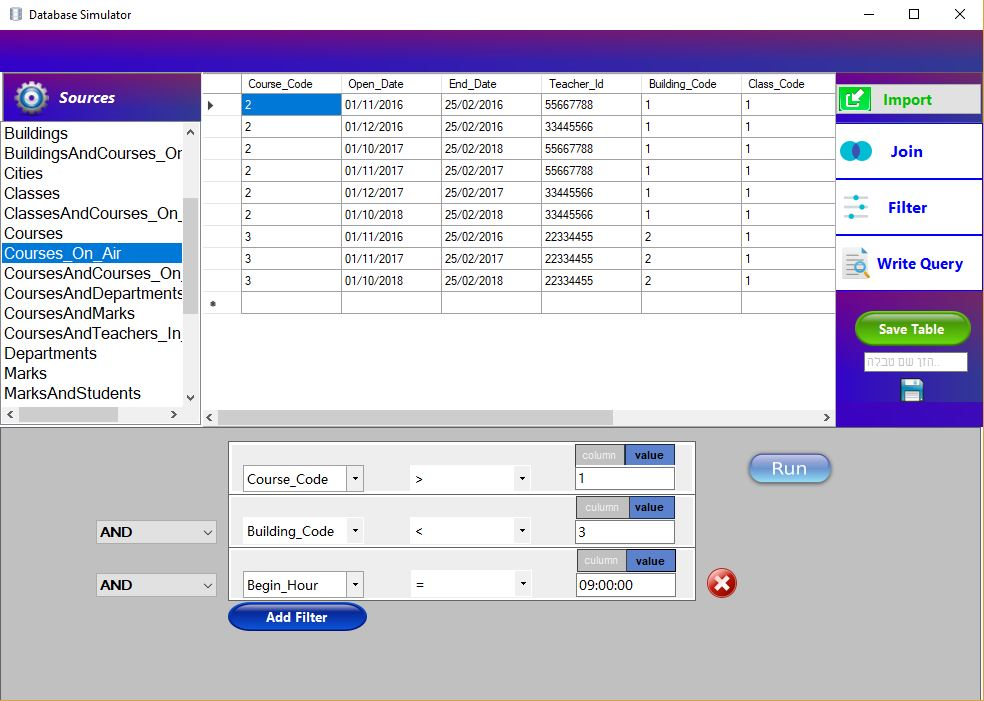
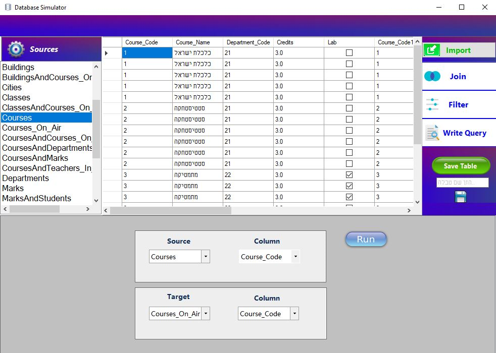
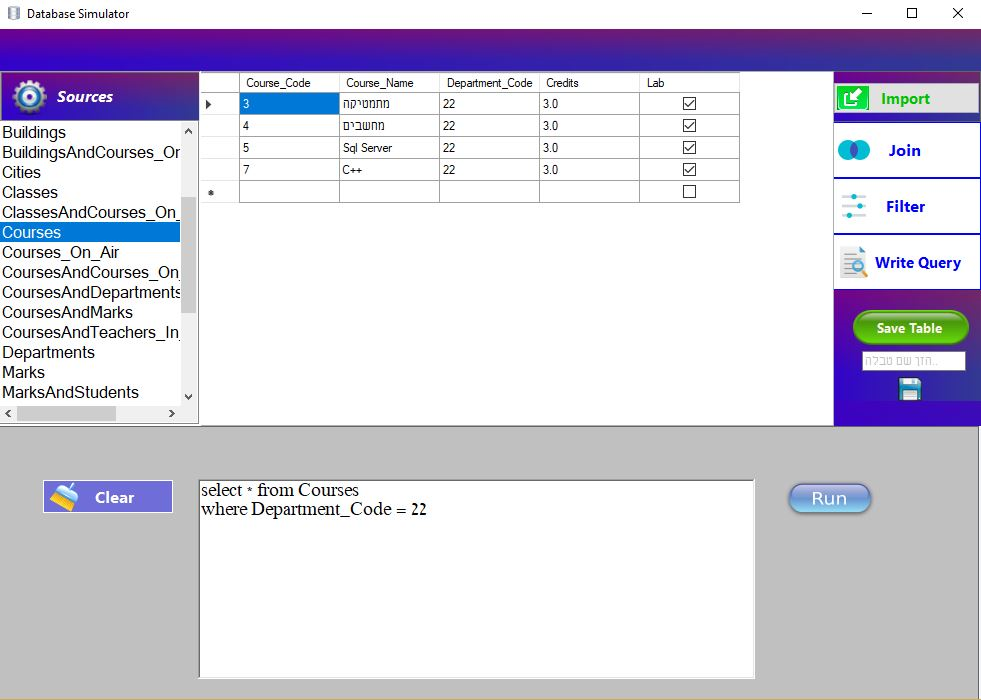

# DatabaseSimulator

A graphical user interface based on SQL Server databases.
 
Made by Windows Forms platform, written with C#.
 
The user can make different queries and save the new table to the local database.  

 

The simulator provides a few operations: 
- Join - provide a join operation between two database tables and display the result on the screen
- Filter - filtering a table according to user selections, and display the result on the screen
- Write Query - write SQL Server query and display the result on the screen
- Import - select a local CSV file and import it as a new table to the selected database. Display the new table on the screen
 

The user is able to save the new displaying table into the database at any given time.

<h2>Screenshots:</h2>
                                                                                                                               

    <h3>1. Login Page</h3>
    

=================================================================================

    <h3>2. Chose a database from SQL Server</h3>
                                                                                                                                   
    

=================================================================================

    <h3>3. Filter operation #1</h3>
    

=================================================================================

    <h3>4. Filter operation #2</h3>
    

=================================================================================

    <h3>5. Join operation</h3>
    

=================================================================================

    <h3>6. Write Query operation</h3>
    

